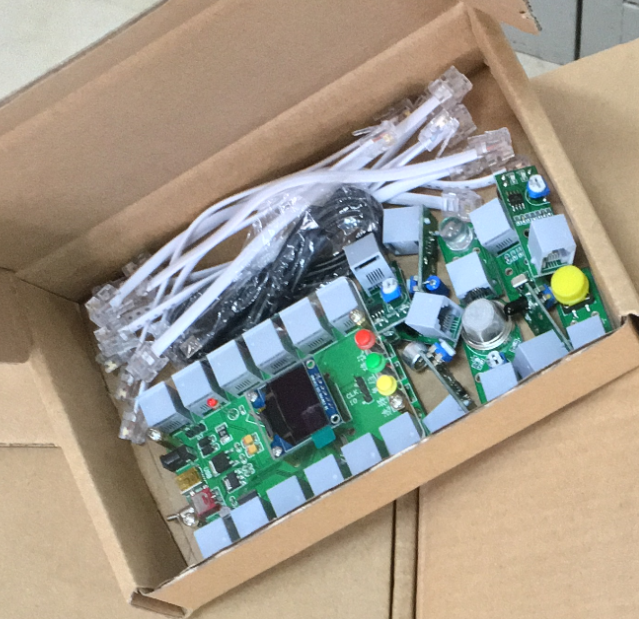
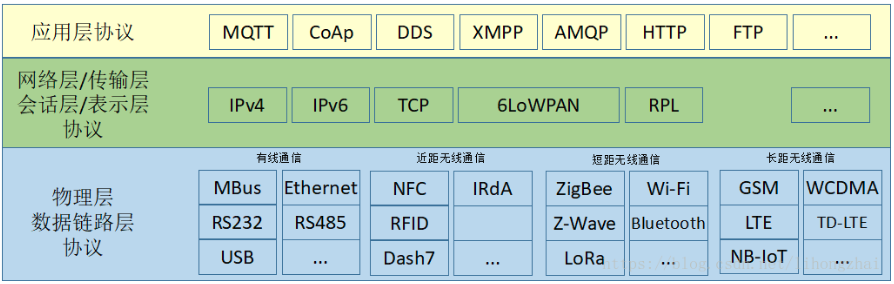

# IoT
&nbsp;&nbsp;&nbsp;&nbsp;
   想独自一人完成一个完整的IoT神奇世界，是不容易的。需要熟练一款单片机的开发，它将用在边缘处理等工作。需要会后端开发，它将完成物联设备传送过来的数据处理等工作。
当然工具类的东西，会用就好。  
我们分为三个阶段，  
&nbsp;&nbsp;&nbsp;&nbsp;
   第一阶段：入门一款单片机开发、原理图绘制、电路板绘制和服务器部署。  
&nbsp;&nbsp;&nbsp;&nbsp;
   第二阶段：熟悉通信协议  
&nbsp;&nbsp;&nbsp;&nbsp;
   第三阶段：项目实战  

# 第一阶段
- 入门STM32单片机开发  
- 入门Altuim designer电路板绘制  
- 入门阿里云服务器部署  
注：内容零散不连贯。  
	
## 入门STM32单片机开发
  [MCU-STM32](https://www.stmcu.com.cn/)   
  [C language](http://www.runoob.com/cprogramming/c-tutorial.html)   
  IDE:[MDK5](http://www2.keil.com/mdk5/)（keil编译器）   
  lib:[V3.5标准库](./theFirstStage/MCUProgram/STM32F103VBT6/Libraries.zip) <
  
  [MCUProgram文件](./theFirstStage/MCUProgram)说明：
  	
	MCUProgram                 #MCU控制器练习入门
        └── STM32F103VBT6
            └── 0_工程模板_DEMO
                    │   └── stm32_demo
                    │       ├── doc
                    │       ├── lib
                    │       ├── obj
                    │       ├── pro
                    │       └── user
                    ├── 10_声音检测（OLED显示）
                    ├── 11_红外解码（OLED显示）
                    ├── 12_电机驱动PWM控制
                    ├── 13_超声测距（OLED显示）
                    ├── 1_GPIO控制LED
                    ├── 2_按键控制蜂鸣器
                    ├── 3_串口通信
                    ├── 4_按键中断
                    ├── 5_TIM定时器
                    ├── 6_PWM控制LED
                    ├── 7_独立看门狗
                    ├── 8_RTC（串口显示）
                    ├── 9_ADC（串口显示）
                    ├── keilClean.bat
                    ├── Libraries.zip
                    └── readme.md
            
### 拓展
  如果精力足够，了解Python语言和树莓派。   
  - [Python](https://www.python.org/)   
  - [树莓派](https://www.raspberrypi.org/)   
  - 当然支持国产[香蕉派](https://www.banana-pi.org.cn/)也是可以的  
		
## 入门Altuim designer电路板绘制
  EDA=[altuim designer](https://www.altium.com.cn/) （版本14以上）。   
  [1. 利用altuim degiser创建标准PCB工程。](https://blog.csdn.net/qq_21508727/article/details/79547067)   
  [2. PCB板布局原则、布线技巧(图解)。](./doc/PCB%E6%9D%BF%E5%B8%83%E5%B1%80%E5%8E%9F%E5%88%99%E3%80%81%E5%B8%83%E7%BA%BF%E6%8A%80%E5%B7%A7(%E5%9B%BE%E8%A7%A3).pdf)  
  [3. 硬件工程师手册-深圳华为。](./doc/%E7%A1%AC%E4%BB%B6%E5%B7%A5%E7%A8%8B%E5%B8%88%E6%89%8B%E5%86%8C-%E6%B7%B1%E5%9C%B3%E5%8D%8E%E4%B8%BA.pdf)  
  
  [PCB文件](./theFirstStage/PCB)说明:
  
    PCB             #电路原理图和PCB绘制练习入门
    ├── controller
    │   └── VBT6PCB_V1.2
    └── sensor
        ├── 10_舵机超声接口
        ├── 11_测速
        ├── 12_LED
        ├── 13_按键
        ├── 14_人体热红外探测
        ├── 1_红外解码
        ├── 2_火焰
        ├── 3_Motor Interface
        ├── 4_Ultrasound
        ├── 5_循迹
        ├── 6_buzzer
        ├── 7_sound
        ├── 8_MQ
        ├── 9_震动
        ├── 传感器尺寸.jpg
        └── 传感器尺寸-修改.jpg
             
### 样板图
  

## 入门阿里云服务器部署
  [1. 阿里云服务器申请开通。](https://promotion.aliyun.com/ntms/yunparter/invite.html?userCode=4pt5vrn0)  
  [2. 阿里云centos7配置JDK1.8+Tomcat7+Mysql5.7。](https://blog.csdn.net/qq_21508727/article/details/79592349)  
  [3. 阿里云Centos7安装Redis4.0.8。](https://blog.csdn.net/qq_21508727/article/details/79596423)  
  [4. 阿里云Centos7安装Nginx服务器实现反向代理。](https://blog.csdn.net/qq_21508727/article/details/80071174)  
  [5. 阿里云+github+Hexo部署静态资源博客。](https://blog.csdn.net/qq_21508727/article/details/80044265)  

### 前后端语言及其框架
  前端语言: HTML, CSS, JS  
  前端框架: [Vue](https://cn.vuejs.org/), [Element UI](http://element-cn.eleme.io/#/zh-CN)  
  后端语言: [Kotlin](http://kotlinlang.org/)/[Java](http://www.runoob.com/java/java-tutorial.html), [SQL](http://www.runoob.com/sql/sql-tutorial.html) 
  后端框架: [Javalin](https://javalin.io/)/[SpringBoot](https://spring.io/projects/spring-boot)

# 第二阶段
- 了解物理层的通信协议  
- 了解网络层的通信协议  
- 了解应用层的通信协议  
 如所示图:  
   
  
## 物理层协议  

### 有线通信
- [IIC]()
- [SPI]()
- [UART]()
- [RS485]()

### 近距离无线通信
- [RFID]()
- [NFC]()

### 短距离无线通信
- [Bluetooth]()
- [Wi-Fi]()
- [ZigBee]()
- [LoRa]()

### 长距离无线通信
- [GSM]()
- [NB-IoT]()

## 网络层协议  
- [TCP/IP]()

## 应用层协议  
- [MQTT]()

# 第三阶段
- 系统结构 
- 了解开源物联网管理平台  
- 设计IoT硬件  
- 场景应用  

##　系统结构
    #TODO

## IoT云端

### [开源物联网管理平台](https://github.com/JGPY/hsweb-iot-cloud)
  目的是提供一个开源的物联网管理平台,支持各种设备接入,并完成数据上报,分析,处理等自定义功能。
 
  
## IoT设备
    #TODO
    
    
    
## 场景应用
    #TODO
  
